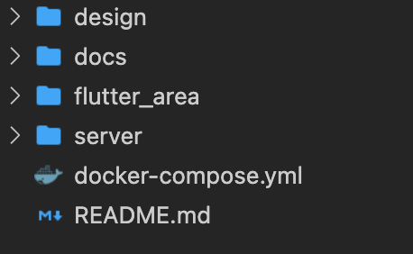
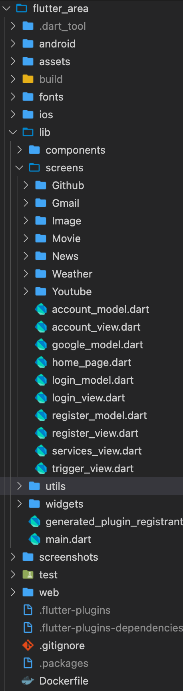
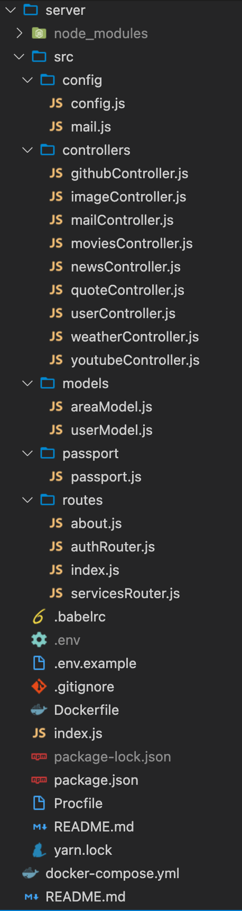

# AREA -> Action REAction (B-YEP-500)

## DESCRIPTION

> The goal of this project is to discover, as a whole, the software platform that you have chosen through the creation of a business application.
To do this, we'll implement a software suite that functions similar to that of IFTTT and/or Zapier.

This software suite will be broken into three parts :

- An application server to implement all the features listed below (see Features)
- A web client to use the application from your browser by querying the application server
- A mobile client to use the application from your phone by querying the application server

- `FRONT-END:` `flutter`

- `BACK-END:` `nodejs`

- `DATABASE:` `mongodb`

- `DEPLOYMENT` `heroku`

## PREREQUISITES
What do you need to install ?
```bash
$ npm
$ nodejs
$ mongodb
$ flutter (Android Studio...)
```

## HOW TO BUILD
Clone the repository and setup env variables.

Go to the `server` folder and see the readme file to create your env variables before launching the project

```bash
$ docker-compose up
```

To clean,
```bash
$ docker-compose down
```

## PROJECT ARCHITECTURE

#### ROOT


#### CLIENT


#### SERVER


## DOCUMENTATION

Go into `docs` directory. You will find documentation about all the API used and how to interact with them

## SERVICES IMPLEMENTED

- **GITHUB** [Documentation](./docs/github.md)

- **WEATHER** [Documentation](./docs/weather.md)

- **MOVIES** [Documentation](./docs/movies.md)

- **NEWS** [Documentation](./docs/news.md)

- **IMAGE** [Documentation](./docs/image_random.md)

- **MAIL** [Documentation](./docs/mail.md)

- **QUOTES** [Documentation](./docs/quotes.md)

- **YOUTUBE** [Documentation](./docs/youtube.md)

- **TIMER**

## TRIGGERS IMPLEMENTED (Actions & Reactions)

- Gmail
    - [x]  weather_mail: Receive weather info. (Reaction)
    - [x]  latest_movie_mail: Receive latest movies informations (Reaction)
    - [x]  top_movies_mail: Receive top movies informations of the moment (Reaction)
    - [x]  top_headlines_mail: Receive news about a word. (Reaction)
    - [x]  top_news_mail: Receive top news. (Reaction)
    - [x]  quote_mail: Receive 5 programming quote. (Reaction)
    - [x]  random_image_mail: Random image by mail. (Reaction)

- Github
    - [x] user_info: Informations about the user
    - [x] repos_list: get all repo of the user
    - [x]  repos_commits: get all commits for a specified repo.
    - [x]  repos_issues: get all issues for a specified repo.

- Youtube
    - [x]  video_infos: get informations about a video researched by a word
    - [x]  channel_infos: get informations about a channel researched by a word
    - [x]  channel_last_video: get latest video of a channel
    - [] post_comment: comment under a specified video (Reaction)
    - [x]  like_video: like the first video researched by a word (Reaction)
    - [x]  dislike_video: like the first video researched by a word (Reaction)

- Weather
    - [x]  get_weather: Get weather infos of a specific city

- Quote
    - [x] get_quote: Get 05 programming quotes

- Lorem Picsum Image
    - [x]  random_image: get an inspiring image

- NewsAPI 📰
    - [x]  top_news: See the most recent top headlines
    - [x]  top_headlines: Search for news about a spefific word

- Movies API
    - [x]  latest_movie: get latest movie informations
    - [x]  top_movies: get top movies list
    - [x]  movie_details: get movie details

- Timer
    - [x] specific_hour: Triggers something at specific day
    - [x] specific_day: Triggers something a specific day

## HOW TO CONTRIBUTE

- Fork it!
- Create your feature branch: `git checkout -b my-new-feature`
- Commit your changes: `git commit -am 'Add some feature'`
- Push to the branch: `git push origin my-new-feature`
- Submit a pull request

## GROUP MEMBERS

- `HONFO Lesly` `lesly.honfo@epitech.eu` [Linkedin](https://www.linkedin.com/in/lesly-honfo-17a92b1a2/)

- `TESSILIMI Hamidou` `hamidou.tessilimi@epitech.eu` [Linkedin](https://www.linkedin.com/in/hamidou-tessilimi-03820a170/)

- `TOMEHO Basilia` `basilia.tomeho@epitech.eu` [Linkedin](https://www.linkedin.com/in/basilia-tomeho-aaa8a1171/)

- `DOSSOU Wahab` `wahab.dossou@epitech.eu` [Linkedin](https://www.linkedin.com/in/wahabdossou9459261a2/)

- `LAWSON Stephen` `stephen.lawson@epitech.eu` [Linkedin](https://www.linkedin.com/in/stephen-lawson-80b7671a2/)